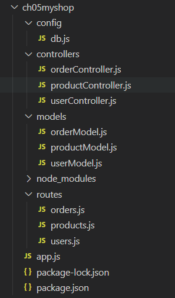
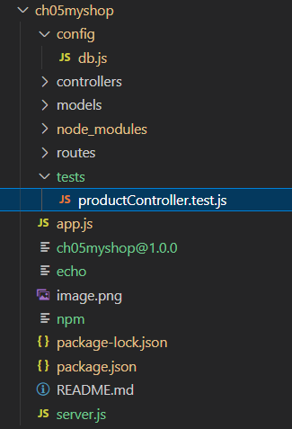

# 5장: Node.js를 활용하여 모놀리식 서비스 구현, 비즈니스 로직 개발, 데이터베이스 연동 및 테스트
# **1. 파일 구성**

- 새 프로젝트를 생성 하고 필요한 모듈을 설치 합니다.

```bash
npm init -y
npm i -S express
npm i -S cors
npm i -S mysql2
npm i -D nodemon
```

- nodemon 모듈 실행 스크립트를 package.json에 추가
    - 실행: npm run dev

```json
{
  "name": "ch05myshop",
  "version": "1.0.0",
  "main": "index.js",
  "scripts": {
    "dev": "nodemon app.js",
    "test": "echo \"Error: no test specified\" && exit 1"
  },
  "keywords": [],
  "author": "",
  "license": "ISC",
  "description": "",
  "dependencies": {
    "cors": "^2.8.5",
    "express": "^4.21.0",
    "mysql2": "^3.11.3"
  },
  "devDependencies": {
    "nodemon": "^3.1.7"
  }
}
```

- 프로젝트를 체계적으로 관리하기 위해 폴더와 파일을 구조화합니다. 이렇게 하면 코드가 많아져도 쉽게 찾고 수정할 수 있습니다.
- 쇼핑몰 프로젝트를 위한 기본적인 파일 구조
    
    
    | **폴더/파일** | **설명** |
    | --- | --- |
    | `app.js` | 메인 서버 파일 |
    | `routes/products.js` | 상품 관련 라우터 |
    | `routes/users.js` | 회원 관련 라우터 |
    | `routes/orders.js` | 주문 관련 라우터 |
    | `controllers/productController.js` | 상품 관련 컨트롤러 |
    | `controllers/userController.js` | 회원 관련 컨트롤러 |
    | `controllers/orderController.js` | 주문 관련 컨트롤러 |
    | `models/productModel.js` | 상품 모델 |
    | `models/userModel.js` | 회원 모델 |
    | `models/orderModel.js` | 주문 모델 |
    | `config/db.js` | 데이터베이스 설정 파일 |
    
    
    

# **2. REST API 서버 구현**

- Node.js를 사용해 클라이언트 요청을 처리하는 API 서버를 개발합니다.
- `app.js`에서 Express로 간단한 서버를 시작합니다.
    
    ```jsx
    // app.js
    const express = require('express');
    const app = express();
    app.use(express.json());
    
    // 라우터 연결
    const productRoutes = require('./routes/products');
    app.use('/products', productRoutes);
    
    app.listen(3000, () => {
      console.log('Server running on <http://localhost:3000>');
    });
    ```
    
- 라우터 연결을 위해서는 먼저 /routes 디렉토리에 라우터 관련 파일이 먼저 구현 되어야 합니다.
    
    ```jsx
    // routes/products.js
    const express = require('express');
    const router = express.Router();
    const productController = require('../controllers/productController');
    
    // 모든 상품 조회
    router.get('/', productController.getAllProducts);
    
    // 특정 상품 조회
    router.get('/:id', productController.getProductById);
    
    // 새 상품 추가
    router.post('/', productController.createProduct);
    
    // 상품 정보 수정
    router.put('/:id', productController.updateProduct);
    
    // 상품 삭제
    router.delete('/:id', productController.deleteProduct);
    
    module.exports = router;
    ```
    
- 라우터 파일에서는 /controllers/productController.js 모듈을 사용 합니다.
- 컨트롤러들은 router 메서드에서 사용되는 콜백 함수들입니다. 각각 메서드를 exports에 추가 해 주면 시용하는 router에서 참조 해서 사용 할 수 있습니다.
- **const productController = require('../controllers/productController');** 형식으로 사용하거나
- **const {** getAllProducts **}= require('../controllers/productController');** 처럼 하나씩 등록해서 사용 할 수 있습니다.
    
    ```jsx
    // controllers/productController.js
    const Product = require('../models/productModel');
    
    // 모든 상품 조회
    exports.getAllProducts = async (req, res) => {
      try {
        const products = await Product.findAll();
        res.status(200).json(products);
      } catch (error) {
        res.status(500).json({ message: '상품을 조회하는 중 오류가 발생했습니다.', error });
      }
    };
    
    // 특정 상품 조회
    exports.getProductById = async (req, res) => {
      try {
        const product = await Product.findById(req.params.id);
        if (product) {
          res.status(200).json(product);
        } else {
          res.status(404).json({ message: '상품을 찾을 수 없습니다.' });
        }
      } catch (error) {
        res.status(500).json({ message: '상품을 조회하는 중 오류가 발생했습니다.', error });
      }
    };
    
    // 새 상품 추가
    exports.createProduct = async (req, res) => {
      try {
        const { name, price, description } = req.body;
        const newProduct = await Product.create({ name, price, description });
        res.status(201).json(newProduct);
      } catch (error) {
        res.status(500).json({ message: '상품을 추가하는 중 오류가 발생했습니다.', error });
      }
    };
    
    // 상품 정보 수정
    exports.updateProduct = async (req, res) => {
      try {
        const { id } = req.params;
        const { name, price, description } = req.body;
        const updatedProduct = await Product.update(id, { name, price, description });
        if (updatedProduct) {
          res.status(200).json(updatedProduct);
        } else {
          res.status(404).json({ message: '상품을 찾을 수 없습니다.' });
        }
      } catch (error) {
        res.status(500).json({ message: '상품을 수정하는 중 오류가 발생했습니다.', error });
      }
    };
    
    // 상품 삭제
    exports.deleteProduct = async (req, res) => {
      try {
        const { id } = req.params;
        const deleted = await Product.delete(id);
        if (deleted) {
          res.status(200).json({ message: '상품이 삭제되었습니다.' });
        } else {
          res.status(404).json({ message: '상품을 찾을 수 없습니다.' });
        }
      } catch (error) {
        res.status(500).json({ message: '상품을 삭제하는 중 오류가 발생했습니다.', error });
      }
    };
    
    ```
    

# **3. 비즈니스 로직 개발**

- 실제로 필요한 기능을 만들고, 상품 관리, 회원 관리, 구매 관리의 핵심 기능을 구현합니다.
- 컨트롤러 모듈에서는 /models/productModel.js 모듈을 사용 합니다.
- 이 코드는 데이터베이스에서 상품 정보를 가져오고, 새로운 상품을 추가하는 기능을 구현합니다.
- Product 객체 리터럴의 속성으로 추가 합니다. 이렇게 구현 하면 사용 하는곳에서  `Product.findAll()` 과 같은 형식으로 사용 하게 됩니다.
    
    ```jsx
    // models/productModel.js
    const db = require('../config/db');
    
    const Product = {
      // 모든 상품 조회
      findAll: async () => {
        try {
          const [rows] = await db.query('SELECT * FROM Products');
          return rows;
        } catch (error) {
          throw error;
        }
      },
    
      // ID로 특정 상품 조회
      findById: async (id) => {
        try {
          const [rows] = await db.query('SELECT * FROM Products WHERE id = ?', [id]);
          return rows[0];
        } catch (error) {
          throw error;
        }
      },
    
      // 새 상품 추가
      create: async (product) => {
        const { name, price, description } = product;
        try {
          const [result] = await db.query(
            'INSERT INTO Products (name, price, description) VALUES (?, ?, ?)',
            [name, price, description]
          );
          return { id: result.insertId, ...product };
        } catch (error) {
          throw error;
        }
      },
    
      // 상품 정보 수정
      update: async (id, product) => {
        const { name, price, description } = product;
        try {
          const [result] = await db.query(
            'UPDATE Products SET name = ?, price = ?, description = ? WHERE id = ?',
            [name, price, description, id]
          );
          if (result.affectedRows === 0) return null; // 해당 ID의 상품이 없는 경우
          return { id, ...product };
        } catch (error) {
          throw error;
        }
      },
    
      // 상품 삭제
      delete: async (id) => {
        try {
          const [result] = await db.query('DELETE FROM Products WHERE id = ?', [id]);
          return result.affectedRows > 0;
        } catch (error) {
          throw error;
        }
      }
    };
    
    module.exports = Product;
    
    ```
    

# **4. DB 연동**

- 모델은 DB와 연결 해야 하기 때문에 /config/db.js 모듈을 사용합니다.
    
    ```jsx
    // config/db.js
    const mysql = require('mysql2/promise');
    
    const pool = mysql.createPool({
      host: 'localhost',
      user: 'comstudy',        // 생성한 사용자 이름
      password: '1234',        // 사용자 비밀번호
      database: 'ch04',        // 사용하려는 데이터베이스 이름
      waitForConnections: true,
      connectionLimit: 10,
      queueLimit: 0
    });
    
    module.exports = pool;
    ```
    
- 데이터베이스와 연결하여 데이터를 저장하고 조회할 수 있도록 설정합니다.
- 회원관련 기능과 주문 관련 기능도 이와 같은 방법으로 구현 합니다.

# **5. 테스트**



- 각 기능이 제대로 작동하는지 확인하고, 오류를 찾아 수정합니다.
- `Jest`를 사용하여 간단한 테스트 작성
    - 먼저, Jest와 **supertest**를 설치합니다:
    
    ```bash
    npm install jest supertest --save-dev
    ```
    
    - app.js를 모듈화 하고 server.js를 추가 해서 listen하도록 수정 합니다. (테스트에서 app모듈 사용)
    - `app.js`
    
    ```jsx
    const express = require('express');
    const app = express();
    const cors = require('cors');
    
    app.use(cors());
    app.use(express.json());
    app.use(express.urlencoded({extended:false}));
    
    app.set('port', 3000);
    
    // 라우터 연결
    const productRoutes = require('./routes/products');
    app.use('/products', productRoutes);
    
    module.exports = app;
    ```
    
    - `server.js`
    
    ```jsx
    // server.js
    const app = require('./app');
    
    const PORT = 3000;
    app.listen(PORT, () => {
      console.log(`Server running on http://localhost:${PORT}`);
    });
    
    ```
    
    - `tests/productController.test.js`에서 테스트를 작성합니다.
    
    ```jsx
    // /tests/productController.test.js
    const request = require('supertest');
    const app = require('../app');
    const db = require('../config/db'); // 데이터베이스 연결 모듈 가져오기
    let server;
    
    beforeAll((done) => {
      server = app.listen(4000, () => {
        done();
      });
    });
    
    afterAll(async () => {
      await server.close(); // 서버 연결 종료
      await db.end(); // 데이터베이스 연결 종료
    });
    
    describe('Product API', () => {
      it('GET /products - should return all products', async () => {
        const response = await request(server).get('/products');
        expect(response.statusCode).toBe(200);
        expect(response.body).toBeInstanceOf(Array);
      });
    
      it('POST /products - should create a new product', async () => {
        const newProduct = { name: 'Test Product', price: 100, description: 'Test Description' };
        const response = await request(server).post('/products').send(newProduct);
        expect(response.statusCode).toBe(201);
        expect(response.body.name).toBe(newProduct.name);
      });
    });
    ```
    
    - `package.json` 파일의 script 수정 (test를 jest로 하도록 수정 합니다.)
    
    ```json
    {
      "name": "ch05myshop",
      "version": "1.0.0",
      "main": "index.js",
      "scripts": {
        "dev": "nodemon server.js",
        **"test": "jest"**
      },
      "keywords": [],
      "author": "",
      "license": "ISC",
      "description": "",
      "dependencies": {
        "cors": "^2.8.5",
        "express": "^4.21.0",
        "mysql2": "^3.11.3"
      },
      "devDependencies": {
        "jest": "^29.7.0",
        "nodemon": "^3.1.7",
        "supertest": "^7.0.0"
      }
    }
    ```
    
- `npm test` 명령으로 테스트를 실행하고 각 기능이 제대로 동작하는지 확인합니다.

```json
npm test
```

- 실행 결과

```bash
workspace-nodejs-msa\ch05myshop>**npm test**

> ch05myshop@1.0.0 test
> jest

 **PASS**  tests/**productController.test.js**
  Product API
    **√** GET /products - should return all products (87 ms)                                         
    **√** POST /products - should create a new product (21 ms)                                       
                                                                                                 
**Test Suites:** **1 passed**, 1 total                                                                   
**Tests:**       **2 passed**, 2 total                                                                   
**Snapshots:**   0 total
**Time:**        1.382 s, estimated 2 s
Ran all test suites.
```

### JEST 공식 문서

- https://jestjs.io/docs/getting-started

# **요약**

- **파일 구성**: 프로젝트를 효율적으로 관리하기 위해 파일과 폴더를 체계적으로 정리.
- **REST API 서버 구현**: Express로 API 서버를 만들고 클라이언트 요청을 처리.
- **MariaDB 연동**: 데이터베이스 연결을 설정하고 데이터를 저장/조회하는 기능 개발.
- **비즈니스 로직 개발**: 실제 기능(상품, 회원, 구매 관리 등)을 개발.
- **테스트**: 각 기능이 잘 작동하는지 확인하고 문제를 해결.