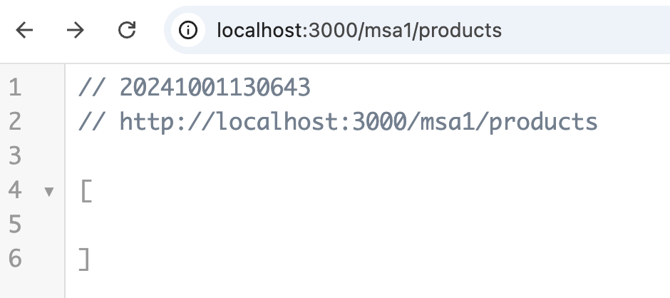
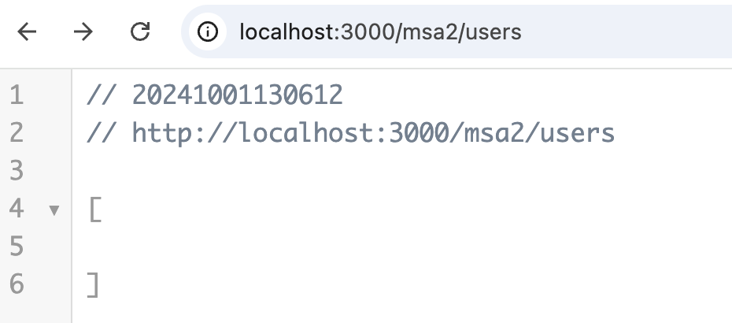
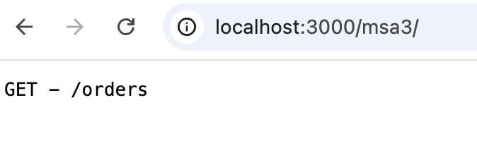

# **모놀리식에서 마이크로서비스로 분리**

모놀리식 서비스에서는 모든 기능이 하나의 큰 애플리케이션 안에 묶여 있습니다. 이를 마이크로서비스로 전환한다는 것은 각 기능을 독립적인 서비스로 나누어 각각 별도로 운영한다는 의미입니다. 이렇게 나누면 각 서비스가 독립적으로 관리되고 배포될 수 있어 유연성과 효율성이 높아집니다. 각 서비스별로 서버를 구현 하고 각 서비스 별 포트 번호를 다르게 하여 동시에 구동 합니다.

## 1. **상품 관리 서비스**

상품을 추가, 수정, 삭제, 조회하는 기능을 제공합니다.

- 상품 관련 데이터를 자체적으로 관리하고, 다른 서비스와 직접 연결되지 않습니다.

```jsx
// 상품 관리 서비스 (products.js)
const express = require('express');
const app = express();
app.use(express.json());

let products = []; // 상품 데이터 저장

// 상품 추가
app.post('/products', (req, res) => {
  const product = req.body;
  product.id = products.length + 1; // 상품 ID 생성
  products.push(product);
  res.status(201).json(product);
});

// 모든 상품 조회
app.get('/products', (req, res) => {
  res.json(products);
});

// 특정 상품 수정
app.put('/products/:id', (req, res) => {
  const productId = parseInt(req.params.id);
  const updatedProduct = req.body;
  const index = products.findIndex(p => p.id === productId);

  if (index !== -1) {
    products[index] = { ...products[index], ...updatedProduct };
    res.json(products[index]);
  } else {
    res.status(404).json({ error: "Product not found" });
  }
});

// 상품 삭제
app.delete('/products/:id', (req, res) => {
  products = products.filter(p => p.id !== parseInt(req.params.id));
  res.status(204).send();
});

module.exports = app;
```

## 2. **회원 관리 서비스**

회원 가입, 로그인, 정보 수정 등 회원 관련 기능을 제공합니다.

- 회원 데이터와 관련된 기능을 관리하고, 다른 서비스들은 회원 정보를 이 서비스에 요청합니다.

```jsx
// 회원 관리 서비스 (users.js)
const express = require('express');
const app = express();
app.use(express.json());

let users = []; // 회원 데이터 저장

// 회원 가입
app.post('/users', (req, res) => {
  const user = req.body;
  user.id = users.length + 1; // 회원 ID 생성
  users.push(user);
  res.status(201).json(user);
});

// 모든 회원 조회
app.get('/users', (req, res) => {
  res.json(users);
});

// 회원 로그인 (간단한 이메일/비밀번호 확인)
app.post('/users/login', (req, res) => {
  const { email, password } = req.body;
  const user = users.find(u => u.email === email && u.password === password);

  if (user) {
    res.json({ message: "Login successful", user });
  } else {
    res.status(401).json({ error: "Invalid email or password" });
  }
});

module.exports = app;
```

# 3. **구매 관리 서비스**

상품을 주문하고 결제하는 등의 구매 관련 기능을 제공합니다.

- 구매 정보를 관리하고, 필요할 때 상품 관리 및 회원 관리 서비스와 통신합니다.

```jsx
// 구매 관리 서비스 (orders.js)
const express = require('express');
const axios = require('axios'); // 다른 서비스와 통신하기 위해 사용
const app = express();
app.use(express.json());

let orders = []; // 주문 데이터 저장

// 상품 구매 (회원 ID와 상품 ID를 이용해 주문 생성)
app.post('/orders', async (req, res) => {
  const { userId, productId, quantity } = req.body;

  try {
    // 회원 정보 확인 (회원 관리 서비스 호출)
    const userResponse = await axios.get(`http://localhost:3002/users/${userId}`);
    const user = userResponse.data;

    // 상품 정보 확인 (상품 관리 서비스 호출)
    const productResponse = await axios.get(`http://localhost:3001/products/${productId}`);
    const product = productResponse.data;

    // 주문 생성
    const order = {
      id: orders.length + 1,
      userId,
      productId,
      productName: product.name,
      quantity,
      total: product.price * quantity,
      date: new Date(),
    };

    orders.push(order);
    res.status(201).json(order);
  } catch (error) {
    res.status(400).json({ error: '회원 또는 상품 정보를 확인할 수 없습니다.' });
  }
});

app.get('/', (req, res)=>{
  res.end("GET - /orders")
});

module.exports = app;
```

## **전환의 효과**

- **유지보수 쉬움**: 각 서비스가 독립적으로 운영되므로, 특정 서비스에 변경이 필요할 때 다른 서비스에 영향을 주지 않습니다.
- **확장성**: 필요한 기능만 독립적으로 확장할 수 있어 효율적입니다.
- **안정성**: 한 서비스에 문제가 생겨도 다른 서비스는 정상적으로 작동합니다.

이렇게 마이크로서비스로 전환하면 각 기능이 독립적으로 운영되며, 필요에 따라 확장하거나 수정할 수 있어 개발과 유지보수가 더 쉽고 효율적입니다. 예제 코드를 통해 상품, 회원, 구매 관리 서비스를 각각 독립적으로 구현하고 실행해 볼 수 있습니다.

# 여러 앱을 하나의 포트로 연결 하기

여러 개의 애플리케이션(`app1`, `app2`, `app3`)을 처리하고 싶다면, 미들웨어 로직이나 `express`와 같은 프레임워크를 사용하는 것이 좋습니다.

### Express를 사용하여 여러 앱을 처리하는 예제

Express를 사용하여 여러 앱을 하나의 서버에 연결하는 방법은 다음과 같습니다:

```jsx
const express = require('express');
const http = require('http');

const app1 = express();
const app2 = express();
const app3 = express();

// 각각의 애플리케이션에 라우트를 정의합니다.
app1.get('/', (req, res) => res.send('Hello from App 1'));
app2.get('/', (req, res) => res.send('Hello from App 2'));
app3.get('/', (req, res) => res.send('Hello from App 3'));

// 메인 애플리케이션을 만듭니다.
const mainApp = express();
mainApp.use('/app1', app1);
mainApp.use('/app2', app2);
mainApp.use('/app3', app3);

// HTTP 서버 생성
const server = http.createServer(mainApp);

server.listen(3000, () => {
  console.log('Server is running on port 3000');
});

```

- `/app1` 경로로 요청이 오면 `app1`이, `/app2` 경로로 요청이 오면 `app2`가, `/app3` 경로로 요청이 오면 `app3`가 해당 요청을 처리합니다.
- 이렇게 하면 여러 Express 애플리케이션을 한 서버에서 효과적으로 처리할 수 있습니다.
- `http.createServer()`는 단일 요청 처리기에만 사용되지만, Express와 같은 프레임워크를 사용하면 여러 앱을 효과적으로 구성하고 관리할 수 있습니다.

## server.js에서 마이크로 서비스 통합

```jsx
// server.js
const express = require('express');
const http = require('http');

const msa1 = require('./products');
const msa2 = require('./users');
const msa3 = require('./orders');

// 메인 애플리케이션을 만듭니다.
const mainApp = express();
mainApp.use('/msa1', msa1);
mainApp.use('/msa2', msa2);
mainApp.use('/msa3', msa3);

// HTTP 서버 생성
const server = http.createServer(mainApp);

server.listen(3000, () => {
  console.log('Server is running on http://localhost:3000');
});
```

### 실행 결과

- http://localhost:3000/msa1/products



- http://localhost:3000/msa2/users



- http://localhost:3000/msa3/
    - orders.js 에 app.get(’/’) 패스 추가
    
    ```jsx
    app.get('/', (req, res)=>{
      res.end("GET - /orders")
    });
    ```
    

